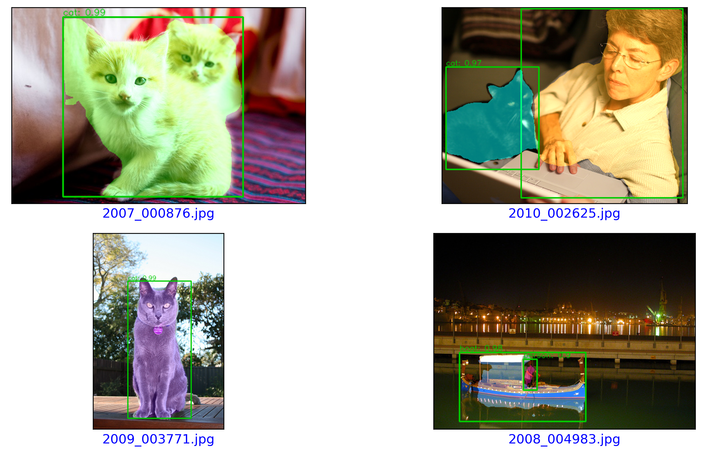
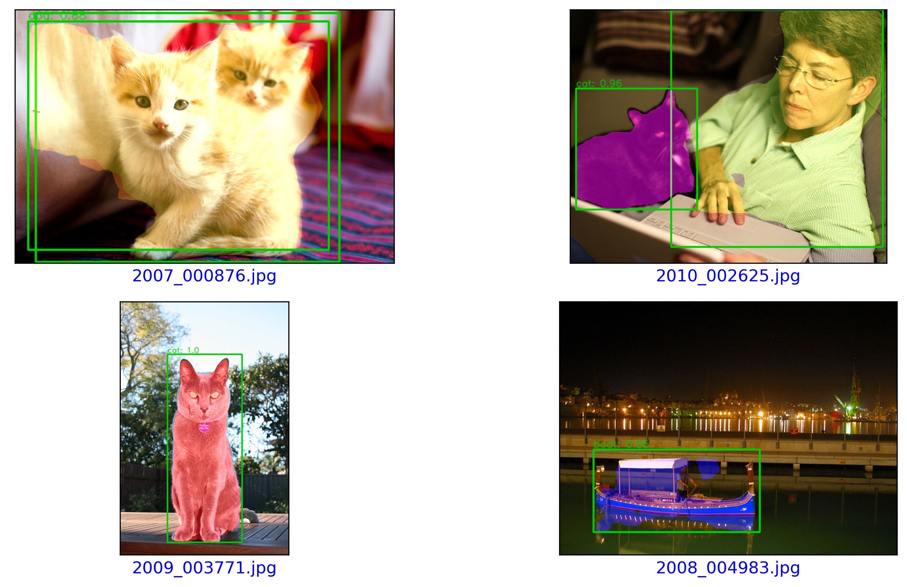

<h1><div style="text-align: center;"> Computer Vision: Pascal VOC dataset</div></h1>

<h2><div style="text-align: center;"> Instance Segmentation and detection of Pascal VOC objects </div></h2>

<h3><div style="text-align: center;"> A Ascencio-Cabral
</div></h3>


## Models

- Faster-RCNN-50-FPN -pretrained off-the-box pytorch network
- Mask-RCNN-50-FPN - pretrained off-the-box  pytorch network
- Mask-RCNN-101-FPN - built with pretrained backbone on ImageNet dataset
- Mask-RCNN-101-FPN with customised anchors sizes=(16, 32, 64, 128, 256, 512) - built with pretrained backbone on ImageNet dataset

### Evaluation - Coco style metrics
 - Mean Average Precision (AP or mAP) at IoU [0.5, 0.05, 0.95], 0.75 and 0.50


## 1. Introduction

With the developments in deep learning, the applicability of computer vision has been widely spread in fields such as robotics, image search, recognition and autonomous driving. In this work Mask-RCNN-ResNet50-FPN, Mask-RCNN-ResNet101-FPN, Mask-RCNN-ResNet101-FPN with customised anchor sizes and Faster-ResNet50-FPN were used for the instance semantic segmentation and object detection on the PASCAL VOC 2012 dataset.


## 3. Methods

### 3.1 Environment

A python environment was setup and the experiments were built using Pytorch. 

### 3.2 Datasets
For this project only the images, annotations and segmented class masks of the Pascal VOC 2012 kit dataset were used [1]. This dataset has 21 classes including the background. The dataset contained in total 2913 images with annotations and ground truth. The holdout method with proportion of 80:10:10 for training, validation and test of the models.

**voc_classes**: ```' __background__ ','aeroplane', 'bicycle', 'bird', 'boat', 'bottle',
                           'bus','car','cat', 'chair', 'cow', 'diningtable', 'dog', 'horse',
                           'motorbike', 'person', 'pottedplant', 'sheep', 'sofa', 'train',
                           'tvmonitor'```

### 3.3 Training

The approach to training was transfer learning and fine tuning the last three layers of the models. The models were trained to minimize the loss with SGD and Adam optimizers, a weght decay of 0.0001 and learning rates of 0.001, 0.005 and 0.0001 with a step scheduler for 5 steps and gamma of 0.2. All models were trained on google colab.


### 3.4 Evaluation metrics

The performance of the model was measured after each epoch training on the validation subset and on the test subset after training. The coco style mean average precision was  measure at IoU thresholds [0:50,0:05,0:95], 0.50 and 0.75 [2]. The mean average precision (mAP) was computed for all classes and per each class on the test subset [3].


## 4. Results - Coco style metrics

Tables 1-2 show the mean average precision of the best models for all classes and per class, respectively. Mask-RCNN-ResNet-50-FPN pretrained with the v2 of the parameters hit the highest mAP for segmentation and detection at all intersections over union (IoU) thresholds (Table 1). It can be observed that the custom size of the anchors had a positive effect on increasing the mAP for Mask-RCNN-101-FPN for both v1 and v2 of the weights (Table 1). This maybe has contributed to detecting occluded or difficult-to-detect objects in images. The Mask-RCNN models' performance was higher with the v2 (Table 1-2). Except for the aeroplane and boat, Mask-RCNN-ResNet-50 FPN all classes obtained the highest detection accuracies (Table 2)

**Table 1.** Best models performance on the test dataset. The mean average precision is a percentage for all Pascal VOC classes 2012. Mask-RCNN-ResNet101-FPN-CA has customised anchors sizes=(16, 32, 64, 128, 256, 512). The best results are shown in __bold__.

|  Network                  | Epochs |   lr  | Optimizer  | mAP @IoU </br>[0:50,0:05,0:95] </br> detection | mAP @IoU=50 </br> detection |mAP @IoU=75 </br>detection | mAP @IoU </br>[0:50,0:05,0:95] </br> segmentation| mAP @IoU=50 </br> segmentation|mAP @IoU=75 </br> segmentation |
|:-------------------------:|:------:|-------:|:----------:|:--------:|:--------:|:--------:|:--------:|:--------:|:--------:|
| Faster-RCNN-ResNet50-FPN  |  15    | 0.005  |   SGD      |   51.7   |  79.1   |   56.13   |  NA     |   NA     |   NA     | 
| Mask-RCNN-ResNet50-FPN    |  15    | 0.005  |   SGD      |   53.6   |  78.2   |   62.43  |  44.56   |  71.43    |  47.7 | 
| Mask-RCNN-ResNet101-FPN   |  20    | 0.0001 |   Adam     |   42.1   |  72.2   |   44.4  |  38.2   | 64.2    |  39.8    | 
| Mask-RCNN-ResNet101-FPN-CA<sup>&</sup>|  20    | 0.0001 |   Adam     |   43.7   |  69.9   |   48.8   |  39.2   |   63.9   |   42.5  |
| Mask-RCNN-ResNet50-FPN<sup>&</sup>    |  20    | 0.005  |   SGD      |   **73.51**   |  **92.08**   |   **84.86**  |  **66.7**    |  **91.04**    |  **75.01** | 
| Mask-RCNN-ResNet101-FPN<sup>&</sup>   |  20    | 0.0001 |   Adam     |   42.82  |  80.0  |   52.18  |  49.62   | 78.25   |  55.29    | 
| Mask-RCNN-ResNet101-FPN-CA<sup>&</sup> |  20    | 0.0001 |   Adam     |   60.97   |  85.62   |   68.61   |  56.03  |   83.67   |   61.25  |

<sup>&</sup> Results were obtained by fine-tuning the models using the weight version 2.


**Table 2.** Best models performance on the test dataset. The mean average precision is given per each object class of the Pascal VOC 2012 dataset. All results are shown in percentages. Mask-RCNN-ResNet101-FPN-CA has customised anchors sizes=(16, 32, 64, 128, 256, 512).

|Model|Task  |aeroplane|bicycle|bird|boat|bottle|bus|car|cat|chair|cow|diningtable|dog|horse|motorbike|person|pottedplant|sheep|sofa|train|tvmonitor
|---|:---:|---|---|---|---|---|---|---|---|---|---|---|---|---|---|---|---|---|---|---|---|
|Faster-RCNN-ResNet50-FPN| detection| 92\.5|	68\.17|	89\.73|	76\.43|	69\.0|	92\.32|	81\.42|	85\.87|48\.28|	78\.64|	53\.57|	84\.38	|88\.61|93\.32	|89\.21	|71\.39	|57\.67	|80\.08	|94\.1	|87\.68|
|Mask-RCNN-ResNet50-FPN<sup>&</sup>|detection|94\.91|__95\.45__|__93\.16__|93\.03|__86\.3__|__99\.84__|__93\.23__|__93\.72__|__84\.78__|__93\.18__|__91\.42__|__94\.26__|__97\.36__|__95\.78__|__94\.35__|__82\.14__|__90\.05__|__80\.49__|__98\.77__|__89\.43__|
|Mask-RCNN-ResNet50-FPN<sup>&</sup>|segmentation|95\.79|__95\.91__|93\.16|85\.4|__86\.12__|__99\.84__|__93\.93__|__93\.72__|__80\.58__|__93\.99__|__89\.91__|__92\.57__|__97\.36__|__95\.78__|__94\.21__|__83\.61__|__90\.05__|__70\.72__|__98\.77__|__89\.43__|
|Mask-RCNN-ResNet101-FPN<sup>&</sup> |detection|81\.08|86\.14|81\.77|86\.67|68\.85|95\.55|75\.43|83\.41|69\.79|71\.82|73\.77|82\.97|74\.76|86\.72|89\.02|78\.17|81\.37|58\.37|86\.88|87\.46|
|Mask-RCNN-ResNet101-FPN<sup>&</sup> |segmentation|83\.99|75\.4|83\.76|84\.12|64\.91|94\.15|74\.92|83\.41|61\.93|71\.82|66\.31|82\.77|73\.26|86\.68|87\.67|80\.03|83\.24|53\.21|86\.88|86\.46|
|Mask-RCNN-ResNet101-FPN-CA<sup>&</sup>|detection|__97\.11__|86\.02|92\.59|__94\.73__|67\.88|89\.2|87\.47|89\.2|78\.35|84\.82|84\.95|82\.84|88\.24|92\.61|90\.93|76\.63|81\.53|68\.6|93\.47|85\.28|
|Mask-RCNN-ResNet101-FPN-CA<sup>&</sup>|segmentation|__97\.11__|73\.47|__94\.68__|__92\.53__|67\.88|89\.2|87\.47|89\.97|69\.28|85\.93|69\.15|79\.87|87\.69|93\.85|90\.3|78\.02|82\.42|66\.41|94\.65|83\.53|

<sup>&</sup> Results by class were obtained by fine-tuning the models using the weight version 2.

### 4.1 Inference

Models inference on the test subset are depicted in Figure 1.

<p align="center">
</p>
<p align="center">
(a)
</p>
<p align="center">
</p>  
<p align="center">
(b)
</p>
<p align="center">
</p>  
<p align="center">
(c)
</p>
<p align="center">
</p>  
<p align="center">
(d)
</p>

<p align="center">
 
**Figure 1**. Trained Models inference on the test set. **(a)** Faster-RCNN-ResNet-50-FPN. **(b)** Mask-RCNN-ResNet50-FPN. **(c)** Mask-RCNN-ResNet101-FPN. **(d)** Mask-RCNN-ResNet101-FPN-CA. </p>


## References

[1] The PASCAL Visual Object Classes Homepage’. http://host.robots.ox.ac.uk/pascal/VOC/

[2] COCO - Common Objects in Context’. https://cocodataset.org/#detection-eval (accessedAug. 02, 2020).

[3] K. Morabia, J. Arora, and T. Vijaykumar, ‘Attention-based Joint Detection of Object and Semantic Part’, arXiv:2007.02419 [cs], Jul. 2020, Accessed: Jul. 02, 2020. [Online]. Available: http://arxiv.org/abs/2007.02419


